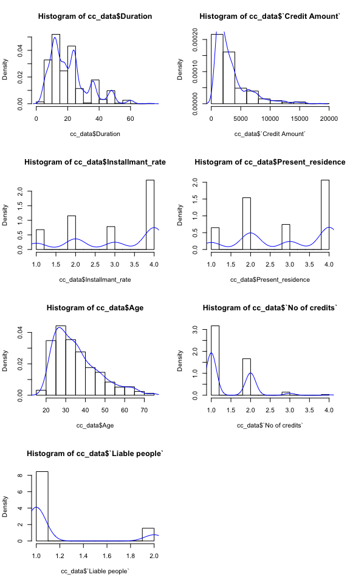
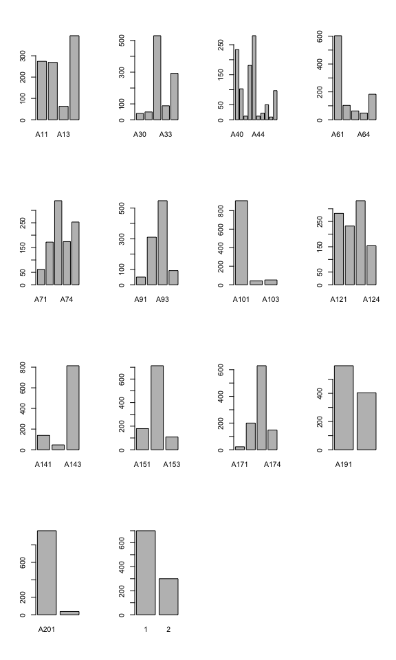
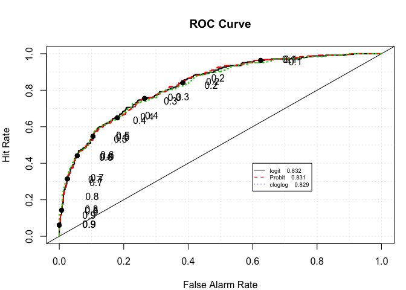
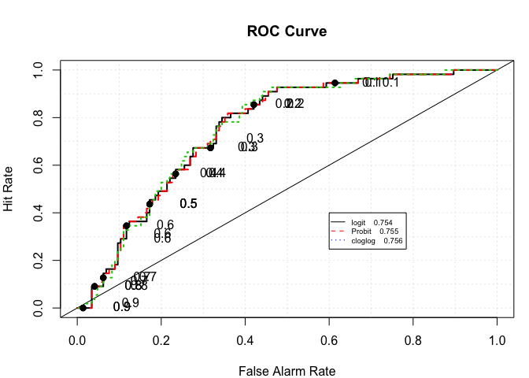
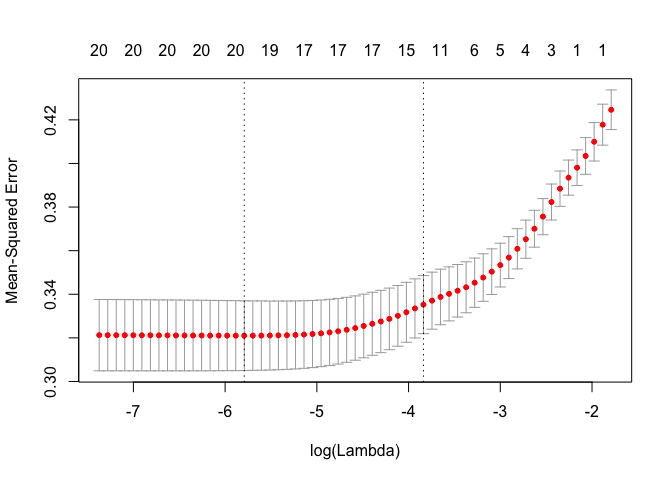
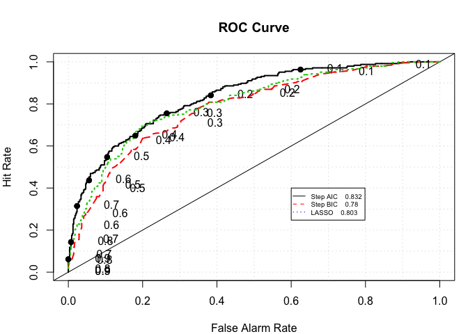
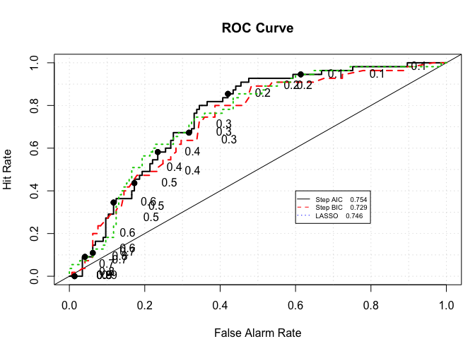
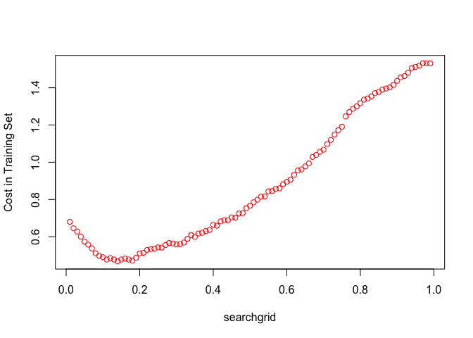

German Credit Data - Risk Analysis using Logistic Regression
================
Anumeha Dwivedi
4 February 2018

### Loading libraries

``` r
library(dplyr)
library(tidyr)
library(ggplot2)
library(readr)
library(Hmisc)
library(corrplot)
library(leaps)
library(glmnet)
library(ROCR)
library(verification)
library(psych)
```

### Exploratory Data Analysis (EDA) and Data Pre-processing

``` r
cc_data <- read_csv("/Users/tinycloud/Documents/Spring 18/Data Mining 1/Data/German_Credit_Card_Data.csv")
num_var <- c(2,5,8,11,13,16,18)
factor_var <- c(1,3,4,6,7,9,10,12,14,15,17,19,20,21)
cc_data[,factor_var] <- lapply(cc_data[,factor_var] , factor)
cc_data[num_var] <- sapply(cc_data[num_var] , as.numeric)
summary(cc_data[factor_var])
```

    ##  Existing_checking_account Credit_history    Purpose    Savings account
    ##  A11:274                   A30: 40        A43    :280   A61:603        
    ##  A12:269                   A31: 49        A40    :234   A62:103        
    ##  A13: 63                   A32:530        A42    :181   A63: 63        
    ##  A14:394                   A33: 88        A41    :103   A64: 48        
    ##                            A34:293        A49    : 97   A65:183        
    ##                                           A46    : 50                  
    ##                                           (Other): 55                  
    ##  Present employment since Personal status and Tax
    ##  A71: 62                  A91: 50                
    ##  A72:172                  A92:310                
    ##  A73:339                  A93:548                
    ##  A74:174                  A94: 92                
    ##  A75:253                                         
    ##                                                  
    ##                                                  
    ##  Other debtors / guarantors Property   Other installment plans Housing   
    ##  A101:907                   A121:282   A141:139                A151:179  
    ##  A102: 41                   A122:232   A142: 47                A152:713  
    ##  A103: 52                   A123:332   A143:814                A153:108  
    ##                             A124:154                                     
    ##                                                                          
    ##                                                                          
    ##                                                                          
    ##    Job      Telephone  Foreign Worker Default
    ##  A171: 22   A191:596   A201:963       1:700  
    ##  A172:200   A192:404   A202: 37       2:300  
    ##  A173:630                                    
    ##  A174:148                                    
    ##                                              
    ##                                              
    ## 

``` r
par(mfrow = c(4,2))
hist(cc_data$Duration, freq = FALSE)
lines(density(cc_data$Duration), col= "blue")
hist(cc_data$`Credit Amount`, probability = TRUE)
lines(density(cc_data$`Credit Amount`), col= "blue")
hist(cc_data$Installmant_rate, probability = TRUE)
lines(density(cc_data$Installmant_rate), col= "blue")
hist(cc_data$Present_residence, probability = TRUE)
lines(density(cc_data$Present_residence), col= "blue")
hist(cc_data$Age, probability = TRUE)
lines(density(cc_data$Age), col= "blue")
hist(cc_data$`No of credits`, probability = TRUE)
lines(density(cc_data$`No of credits`), col= "blue")
hist(cc_data$`Liable people`, probability = TRUE)
lines(density(cc_data$`Liable people`), col= "blue")

par(mfrow = c(4,4))
```



``` r
barplot(table(cc_data$Existing_checking_account))
barplot(table(cc_data$Credit_history))
barplot(table(cc_data$Purpose))
barplot(table(cc_data$`Savings account`))
barplot(table(cc_data$`Present employment since`))
barplot(table(cc_data$`Personal status and Tax`))
barplot(table(cc_data$`Other debtors / guarantors`))
barplot(table(cc_data$Property))
barplot(table(cc_data$`Other installment plans`))
barplot(table(cc_data$Housing))
barplot(table(cc_data$Job))
barplot(table(cc_data$Telephone))
barplot(table(cc_data$`Foreign Worker`))
barplot(table(cc_data$Default))
```



### Splitting into test and train

``` r
set.seed(12363925)
index <- sample(1:nrow(cc_data), 0.8*nrow(cc_data))
train <- cc_data[index,]
test <- cc_data[-index,]
```

### Trying different link functions

``` r
log.fit <- glm(Default ~ Existing_checking_account + Duration + Credit_history + Purpose + 
                  `Credit Amount` + `Savings account` + Installmant_rate + `Other debtors / guarantors` 
                + `Other installment plans` + `No of credits` + Telephone + `Foreign Worker`, 
                data = train, family = binomial)

log.fit.probit <- glm(Default ~ Existing_checking_account + Duration + Credit_history + Purpose + 
                 `Credit Amount` + `Savings account` + Installmant_rate + `Other debtors / guarantors` 
               + `Other installment plans` + `No of credits` + Telephone + `Foreign Worker`, 
               data = train, family = binomial(link = "probit"))

log.fit.cloglog <- glm(Default ~ Existing_checking_account + Duration + Credit_history + Purpose + 
                 `Credit Amount` + `Savings account` + Installmant_rate + `Other debtors / guarantors` 
               + `Other installment plans` + `No of credits` + Telephone + `Foreign Worker`, 
               data = train, family = binomial(link = "cloglog"))

summary(log.fit)
summary(log.fit.probit)
summary(log.fit.cloglog)
```

#### Comparing AIC and BIC for the models with different links

``` r
AIC(log.fit)
```

    ## [1] 783.5598

``` r
AIC(log.fit.probit)
```

    ## [1] 783.4977

``` r
AIC(log.fit.cloglog)
```

    ## [1] 780.4556

``` r
BIC(log.fit)
```

    ## [1] 928.7827

``` r
BIC(log.fit.probit)
```

    ## [1] 928.7207

``` r
BIC(log.fit.cloglog)
```

    ## [1] 925.6786

### Hit rates and ROC curves for the 3 links on training data

``` r
log_train_pred <- predict(log.fit, type = "response")
prob_train_log <- ifelse(log_train_pred > 0.5, 2, 1)
mean(prob_train_log == train$Default) 
```

    ## [1] 0.78875

``` r
probit_train_pred <- predict(log.fit.probit, type = "response")
prob_train_probit <- ifelse(probit_train_pred > 0.5, 2, 1)
mean(prob_train_probit == train$Default)
```

    ## [1] 0.7875

``` r
cloglog_train_pred <- predict(log.fit.cloglog, type = "response")
prob_train_cloglog <- ifelse(cloglog_train_pred > 0.5, 2, 1)
mean(prob_train_cloglog == train$Default)
```

    ## [1] 0.7875

``` r
roc.plot(x = train$Default == "2", pred = cbind(log_train_pred, probit_train_pred,cloglog_train_pred), 
         legend = TRUE, leg.text = c("logit", "Probit", "cloglog"))$roc.vol
```



    ##      Model      Area      p.value binorm.area
    ## 1 Model  1 0.8316896 5.738626e-51          NA
    ## 2 Model  2 0.8314837 6.599055e-51          NA
    ## 3 Model  3 0.8287479 4.188246e-50          NA

### Hit rates and ROC curves for the 3 links on test data

``` r
log_test_pred <- predict(log.fit, newdata = test, type = "response")
prob_test_log <- ifelse(log_train_pred > 0.5, 2, 1)
mean(prob_test_log == test$Default)
```

    ## [1] 0.62

``` r
probit_test_pred <- predict(log.fit.probit, newdata = test, type = "response")
prob_test_probit <- ifelse(probit_train_pred > 0.5, 2, 1)
mean(prob_test_probit == test$Default)
```

    ## [1] 0.62125

``` r
cloglog_test_pred <- predict(log.fit.cloglog, newdata = test, type = "response")
prob_test_cloglog <- ifelse(cloglog_train_pred > 0.5, 2, 1)
mean(prob_test_cloglog == test$Default)
```

    ## [1] 0.62125

``` r
roc.plot(x = test$Default == "2", pred = cbind(log_test_pred, probit_test_pred,cloglog_test_pred), 
         legend = TRUE, leg.text = c("logit", "Probit", "cloglog"))$roc.vol
```



    ##      Model      Area      p.value binorm.area
    ## 1 Model  1 0.7543574 1.438592e-08          NA
    ## 2 Model  2 0.7547335 1.372578e-08          NA
    ## 3 Model  3 0.7557367 1.210588e-08          NA

### Variable selection - step AIC, step BIC and LASSO

``` r
null.model <- glm(Default ~ 1, data = train, family = "binomial")
logstepAIC <- step(null.model, scope = list(lower=null.model, upper=log.fit), k = 2, direction="both")
logstepBIC <- step(null.model, scope = list(lower=null.model, upper=log.fit), direction = "both", 
                   k = log(nrow(train)))

##Lasso
cc_data_scale <- cc_data
cc_data_scale[num_var] <- scale(cc_data_scale[num_var])
cc_data_scale[factor_var] <- sapply(cc_data[factor_var] , as.numeric)
X.train<- as.matrix(cc_data_scale)[index,1:20]
X.test<-  as.matrix(cc_data_scale)[-index,1:20]
Y.train <- cc_data_scale$Default[index]
Y.test <- cc_data_scale$Default[-index]
lasso_fit <- glmnet(x = X.train ,y = Y.train ,alpha = 1 , family = "binomial")
cv.out <- cv.glmnet(x = X.train ,y = Y.train ,alpha = 1 , family = "binomial" ,type.measure = "mse")
plot(cv.out, xvar = "lambda", label=TRUE)
```



``` r
#min value of lambda
lambda_min <- cv.out$lambda.min
#best value of lambda
lambda_1se <- cv.out$lambda.1se
#regression coefficients
coef(cv.out,s=lambda_1se)

logstepAIC$anova
logstepBIC$anova
coef(cv.out,s=lambda_1se)

AIC(logstepAIC)
AIC(logstepBIC)

BIC(logstepAIC)
BIC(logstepBIC)
```

### Model selection

``` r
stepAICpred <- predict(logstepAIC, type = "response")
prob_train_AIC <- ifelse(stepAICpred > 0.5, 2, 1)
mean(prob_train_AIC == train$Default)
```

    ## [1] 0.78875

``` r
stepBICpred <- predict(logstepBIC, type = "response")
prob_train_BIC <- ifelse(stepBICpred > 0.5, 2, 1)
mean(prob_train_BIC == train$Default)
```

    ## [1] 0.755

``` r
lasso_prob_train <- predict(cv.out, newx = X.train, s = lambda_1se, type = "response")
prob_train_lasso <- ifelse(lasso_prob_train > 0.5, 2, 1)
mean(prob_train_lasso == train$Default)
```

    ## [1] 0.76375

``` r
roc.plot(x = train$Default == "2", pred = cbind(stepAICpred, stepBICpred, lasso_prob_train), 
         legend = TRUE, leg.text = c("Step AIC", "Step BIC", "LASSO"))$roc.vol
```



    ##      Model      Area      p.value binorm.area
    ## 1 Model  1 0.8316896 5.738626e-51          NA
    ## 2 Model  2 0.7796948 7.607851e-37          NA
    ## 3 Model  3 0.8025666 9.311367e-43          NA

``` r
stepAICpred <- predict(logstepAIC, newdata = test, type = "response")
prob_test_AIC <- ifelse(stepAICpred > 0.5, 2, 1)
mean(prob_test_AIC == test$Default)
```

    ## [1] 0.72

``` r
stepBICpred <- predict(logstepBIC, newdata = test, type = "response")
prob_test_BIC <- ifelse(stepBICpred > 0.5, 2, 1)
mean(prob_test_BIC == test$Default)
```

    ## [1] 0.715

``` r
lasso_prob_test <- predict(cv.out, newx = X.test, s = lambda_1se, newdata = test, type = "response")
prob_test_lasso <- ifelse(lasso_prob_test > 0.5, 2, 1)
mean(prob_test_lasso == test$Default)
```

    ## [1] 0.715

``` r
roc.plot(x = test$Default == "2", pred = cbind(stepAICpred, stepBICpred, lasso_prob_test), 
         legend = TRUE, leg.text = c("Step AIC", "Step BIC", "LASSO"))$roc.vol
```



    ##      Model      Area      p.value binorm.area
    ## 1 Model  1 0.7543574 1.438592e-08          NA
    ## 2 Model  2 0.7287774 2.994184e-07          NA
    ## 3 Model  3 0.7458307 4.099407e-08          NA

### Finding Optimal Probability

``` r
logstepAIC
```

    ## 
    ## Call:  glm(formula = Default ~ Existing_checking_account + Duration + 
    ##     Credit_history + Purpose + `Savings account` + `Other debtors / guarantors` + 
    ##     Installmant_rate + `Credit Amount` + Telephone + `No of credits` + 
    ##     `Foreign Worker` + `Other installment plans`, family = "binomial", 
    ##     data = train)
    ## 
    ## Coefficients:
    ##                      (Intercept)      Existing_checking_accountA12  
    ##                       -0.3027517                        -0.4129136  
    ##     Existing_checking_accountA13      Existing_checking_accountA14  
    ##                       -0.9557246                        -1.8524719  
    ##                         Duration                 Credit_historyA31  
    ##                        0.0320935                         0.4996745  
    ##                Credit_historyA32                 Credit_historyA33  
    ##                       -0.4496579                        -1.0430816  
    ##                Credit_historyA34                        PurposeA41  
    ##                       -1.5189982                        -1.8914739  
    ##                      PurposeA410                        PurposeA42  
    ##                       -1.6620954                        -0.6033728  
    ##                       PurposeA43                        PurposeA44  
    ##                       -0.9823180                        -0.5883766  
    ##                       PurposeA45                        PurposeA46  
    ##                       -0.1178196                         0.0127947  
    ##                       PurposeA48                        PurposeA49  
    ##                       -1.1936141                        -1.0140060  
    ##             `Savings account`A62              `Savings account`A63  
    ##                       -0.1833923                        -0.3521166  
    ##             `Savings account`A64              `Savings account`A65  
    ##                       -1.3230486                        -1.0676610  
    ## `Other debtors / guarantors`A102  `Other debtors / guarantors`A103  
    ##                        0.7108809                        -1.2400991  
    ##                 Installmant_rate                   `Credit Amount`  
    ##                        0.2936011                         0.0001461  
    ##                    TelephoneA192                   `No of credits`  
    ##                       -0.4685643                         0.3520349  
    ##             `Foreign Worker`A202     `Other installment plans`A142  
    ##                       -1.1052083                        -0.2682962  
    ##    `Other installment plans`A143  
    ##                       -0.5821747  
    ## 
    ## Degrees of Freedom: 799 Total (i.e. Null);  769 Residual
    ## Null Deviance:       985.7 
    ## Residual Deviance: 721.6     AIC: 783.6

``` r
searchgrid = seq(0.01, 0.99, 0.01)
result = cbind(searchgrid, NA)

# in the cost function, both r and pi are vectors, r=truth, pi=predicted probability
cost1 <- function(r, pi) 
{
  weight1 = 5
  weight0 = 1
  c1 = (r == 2) & (pi < pcut)  #logical vector - true if actual 1 but predict 0
  c0 = (r == 1) & (pi > pcut)  #logical vecotr - true if actual 0 but predict 1
  return(mean(weight1 * c1 + weight0 * c0))
}

for (i in 1:length(searchgrid)) 
{
  pcut <- result[i, 1]
  # assign the cost to the 2nd col
  result[i, 2] <- cost1(train$Default, predict(logstepAIC, type = "response"))
}

plot(result, ylab = "Cost in Training Set", col = "red")
```



``` r
result[which(result[,2] == min(result[,2])),]
```

    ## searchgrid            
    ##    0.14000    0.46875

``` r
final_model <- glm(Default ~ Existing_checking_account + Duration + Credit_history + Purpose + 
                         `Credit Amount` + `Savings account` + Installmant_rate + `Other debtors / guarantors` 
                       + `Other installment plans` + `No of credits` + Telephone + `Foreign Worker`, 
                       data = cc_data, family = binomial)
```
