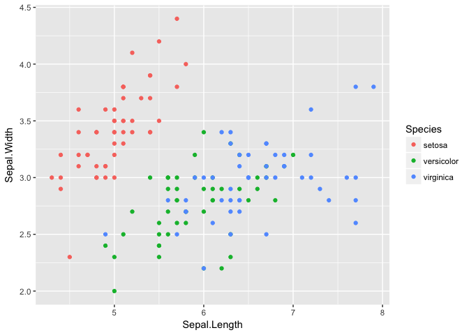
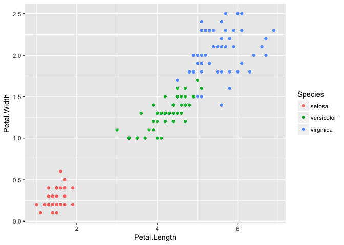

Using KNN for Classification
================
Anumeha Dwivedi
10 January 2018

### Loading Libraries

``` r
library(class)
library(ggplot2)
library(gmodels)
library(GGally)
```

### Understanding Data

``` r
str(iris)
```

    ## 'data.frame':    150 obs. of  5 variables:
    ##  $ Sepal.Length: num  5.1 4.9 4.7 4.6 5 5.4 4.6 5 4.4 4.9 ...
    ##  $ Sepal.Width : num  3.5 3 3.2 3.1 3.6 3.9 3.4 3.4 2.9 3.1 ...
    ##  $ Petal.Length: num  1.4 1.4 1.3 1.5 1.4 1.7 1.4 1.5 1.4 1.5 ...
    ##  $ Petal.Width : num  0.2 0.2 0.2 0.2 0.2 0.4 0.3 0.2 0.2 0.1 ...
    ##  $ Species     : Factor w/ 3 levels "setosa","versicolor",..: 1 1 1 1 1 1 1 1 1 1 ...

``` r
summary(iris)
```

    ##   Sepal.Length    Sepal.Width     Petal.Length    Petal.Width   
    ##  Min.   :4.300   Min.   :2.000   Min.   :1.000   Min.   :0.100  
    ##  1st Qu.:5.100   1st Qu.:2.800   1st Qu.:1.600   1st Qu.:0.300  
    ##  Median :5.800   Median :3.000   Median :4.350   Median :1.300  
    ##  Mean   :5.843   Mean   :3.057   Mean   :3.758   Mean   :1.199  
    ##  3rd Qu.:6.400   3rd Qu.:3.300   3rd Qu.:5.100   3rd Qu.:1.800  
    ##  Max.   :7.900   Max.   :4.400   Max.   :6.900   Max.   :2.500  
    ##        Species  
    ##  setosa    :50  
    ##  versicolor:50  
    ##  virginica :50  
    ##                 
    ##                 
    ## 

``` r
ggpairs(iris)
```


### Data Visualization

``` r
ggplot(data = iris, aes(x = Sepal.Length, y = Sepal.Width, col = Species)) +
  geom_point()
```



``` r
ggplot(data = iris, aes(x = Petal.Length, y = Petal.Width, col = Species)) +
  geom_point()
```



### Scaling the data

``` r
scale_iris <- iris
scale_iris[,1:4] <- scale(iris[,1:4])
```

### Splitting training and test sets

``` r
set.seed(123)
index <- sample(1:nrow(scale_iris), nrow(scale_iris)*0.6)
iris_train <- scale_iris[index,]
iris_test <- scale_iris[-index,]
```

### KNN Model

``` r
error <- c()
for (i in 1:15)
{
  knn.fit <- knn(train = iris_train[,1:4], test = iris_test[,1:4], cl = as.factor(iris_train$Species), k = i)
  error[i] = 1- mean(knn.fit == iris_test$Species)
}

ggplot(data = data.frame(error), aes(x = 1:15, y = error)) +
  geom_line(color = "Blue")
```


We see that for K = 5, we have the smallest error

### Checking accuracy of the final model

``` r
knn.fit <- knn(train = iris_train[,1:4], test = iris_test[,1:4], cl = as.factor(iris_train$Species), k = 5)

CrossTable(x = iris_test$Species, y = knn.fit,prop.chisq=FALSE) 
```

    ## 
    ##  
    ##    Cell Contents
    ## |-------------------------|
    ## |                       N |
    ## |           N / Row Total |
    ## |           N / Col Total |
    ## |         N / Table Total |
    ## |-------------------------|
    ## 
    ##  
    ## Total Observations in Table:  60 
    ## 
    ##  
    ##                   | knn.fit 
    ## iris_test$Species |     setosa | versicolor |  virginica |  Row Total | 
    ## ------------------|------------|------------|------------|------------|
    ##            setosa |         17 |          0 |          0 |         17 | 
    ##                   |      1.000 |      0.000 |      0.000 |      0.283 | 
    ##                   |      1.000 |      0.000 |      0.000 |            | 
    ##                   |      0.283 |      0.000 |      0.000 |            | 
    ## ------------------|------------|------------|------------|------------|
    ##        versicolor |          0 |         23 |          2 |         25 | 
    ##                   |      0.000 |      0.920 |      0.080 |      0.417 | 
    ##                   |      0.000 |      0.958 |      0.105 |            | 
    ##                   |      0.000 |      0.383 |      0.033 |            | 
    ## ------------------|------------|------------|------------|------------|
    ##         virginica |          0 |          1 |         17 |         18 | 
    ##                   |      0.000 |      0.056 |      0.944 |      0.300 | 
    ##                   |      0.000 |      0.042 |      0.895 |            | 
    ##                   |      0.000 |      0.017 |      0.283 |            | 
    ## ------------------|------------|------------|------------|------------|
    ##      Column Total |         17 |         24 |         19 |         60 | 
    ##                   |      0.283 |      0.400 |      0.317 |            | 
    ## ------------------|------------|------------|------------|------------|
    ## 
    ## 

From the above matrix, we see that all our classification for Setosa is correct, we have classified 1 Virginica as Versicolor and 2 Versicolor as Virginica. Overall the accurcy of our model is 57/60 = 95%.
