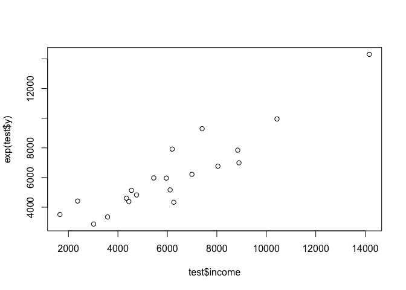

Multiple Linear Regression - Prestige dataset
================
Anumeha Dwivedi
5 January 2018

### Loading libraries

``` r
library(car)
library(ggplot2)
library(dplyr)
library(GGally)
```

### Getting familiar with the dataset

``` r
str(Prestige) #Dataset from car package
head(Prestige)
summary(Prestige)

colSums(is.na(Prestige))
prestige <- na.omit(Prestige)
colSums(is.na(prestige))
```

### Correlation and basic plots

``` r
ggpairs(prestige[1:5])
```


``` r
plot(prestige$type, prestige$income)
```


``` r
ggplot(data = prestige, aes(x = prestige, y = income)) +
  geom_smooth()
```


``` r
ggplot(data = prestige, aes(x = women, y = income)) +
  geom_smooth()
```


``` r
ggplot(data = prestige, aes(x = prestige, y = income, col = type)) +
  geom_smooth()
```


### Splitting into test and train sets

``` r
set.seed(1)
index <- sample(1:nrow(prestige), nrow(prestige)*0.8)
train <- prestige[index,]
test <- prestige[-index,]
```

### Full model

``` r
lm.fit <- lm(income ~., data = prestige)
summary(lm.fit)
```

    ## 
    ## Call:
    ## lm(formula = income ~ ., data = prestige)
    ## 
    ## Residuals:
    ##     Min      1Q  Median      3Q     Max 
    ## -7752.4  -954.6  -331.2   742.6 14301.3 
    ## 
    ## Coefficients:
    ##               Estimate Std. Error t value Pr(>|t|)    
    ## (Intercept)    7.32053 3037.27048   0.002  0.99808    
    ## education    131.18372  288.74961   0.454  0.65068    
    ## women        -53.23480    9.83107  -5.415 4.96e-07 ***
    ## prestige     139.20912   36.40239   3.824  0.00024 ***
    ## census         0.04209    0.23568   0.179  0.85865    
    ## typeprof     509.15150 1798.87914   0.283  0.77779    
    ## typewc       347.99010 1173.89384   0.296  0.76757    
    ## ---
    ## Signif. codes:  0 '***' 0.001 '**' 0.01 '*' 0.05 '.' 0.1 ' ' 1
    ## 
    ## Residual standard error: 2633 on 91 degrees of freedom
    ## Multiple R-squared:  0.6363, Adjusted R-squared:  0.6123 
    ## F-statistic: 26.54 on 6 and 91 DF,  p-value: < 2.2e-16

We see that education is highly correlated with prestige and census both so let's make a model droppping education and census (as prestige is already being included), to avoid multicollinearity issues.

### Model with 2 parameters

``` r
lm.fit2 <- lm(income ~ women + prestige, data = prestige)
summary(lm.fit2)
```

    ## 
    ## Call:
    ## lm(formula = income ~ women + prestige, data = prestige)
    ## 
    ## Residuals:
    ##     Min      1Q  Median      3Q     Max 
    ## -7678.4 -1050.9  -310.1   839.6 14114.3 
    ## 
    ## Coefficients:
    ##             Estimate Std. Error t value Pr(>|t|)    
    ## (Intercept)   653.17     838.09   0.779    0.438    
    ## women         -50.50       8.42  -5.997 3.61e-08 ***
    ## prestige      163.74      15.46  10.593  < 2e-16 ***
    ## ---
    ## Signif. codes:  0 '***' 0.001 '**' 0.01 '*' 0.05 '.' 0.1 ' ' 1
    ## 
    ## Residual standard error: 2587 on 95 degrees of freedom
    ## Multiple R-squared:  0.6334, Adjusted R-squared:  0.6257 
    ## F-statistic: 82.08 on 2 and 95 DF,  p-value: < 2.2e-16

``` r
plot(lm.fit2, pch=16, which=1)
```


### Transformation and final model

Looking at the residual plots, it seems that taking a log transformation of income might be helpful and we can predict it using women and prestige variables.

``` r
lm.fit3 <- lm(log(income) ~ women + prestige, data = prestige)
summary(lm.fit3)
```

    ## 
    ## Call:
    ## lm(formula = log(income) ~ women + prestige, data = prestige)
    ## 
    ## Residuals:
    ##      Min       1Q   Median       3Q      Max 
    ## -0.99182 -0.09790  0.00839  0.12425  0.79493 
    ## 
    ## Coefficients:
    ##               Estimate Std. Error t value Pr(>|t|)    
    ## (Intercept)  7.9255582  0.0780000  101.61   <2e-16 ***
    ## women       -0.0079685  0.0007837  -10.17   <2e-16 ***
    ## prestige     0.0213130  0.0014386   14.81   <2e-16 ***
    ## ---
    ## Signif. codes:  0 '***' 0.001 '**' 0.01 '*' 0.05 '.' 0.1 ' ' 1
    ## 
    ## Residual standard error: 0.2407 on 95 degrees of freedom
    ## Multiple R-squared:  0.7914, Adjusted R-squared:  0.787 
    ## F-statistic: 180.2 on 2 and 95 DF,  p-value: < 2.2e-16

``` r
plot(lm.fit3)
```


### Prediction on test data

Our adjusted R-square is 0.787 and F-statistic is 180.2. This means we now have a model with good precision, so let us predict the income on our test dataset and see.

``` r
test$y <- predict(lm.fit3, newdata = test)
plot(test$income, exp(test$y))
```



``` r
sqrt(mean(sum((exp((test$y-mean(test$y))/sd(test$y)) - ((test$income-mean(test$income))/sd(test$income)))^2)))
```

    ## [1] 9.903218

The plot is decently linear so we have predicted values in close proximity of actual test values. The RMSE for scaled target variable is as low as 9.9.
