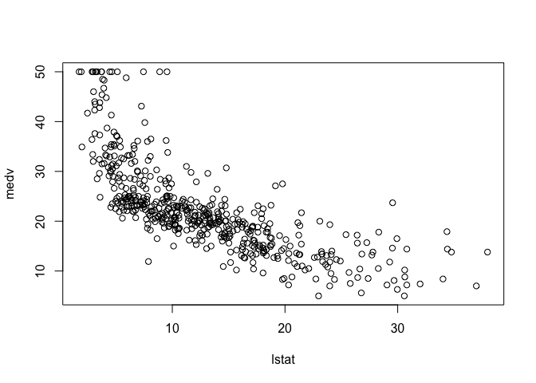
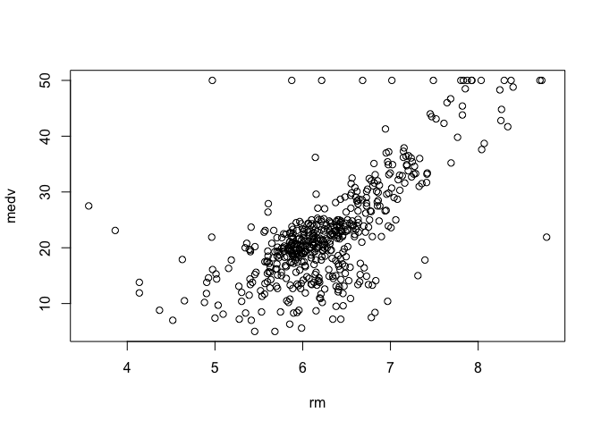
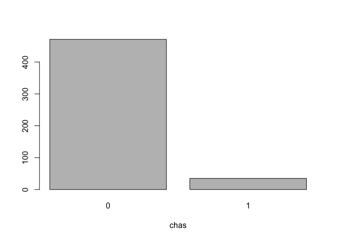

Linear Regression and LASSO on Boston Housing Data
================
Anumeha Dwivedi
01 Feb 2018

### Loading libraries

``` r
library(MASS)
library(GGally)
library(corrplot)
library(glmnet)
library(dplyr)
library(leaps)
```

### Exploratory Data Analysis

``` r
data(Boston)
dim(Boston)
cormat=cor(Boston)
corrplot(cormat, type = "upper", method="number")
```


``` r
Boston$chas<-as.factor(Boston$chas)
```

### Plotting the variables

``` r
plot(medv~lstat, data=Boston)
```



``` r
plot(medv~rm, data=Boston)
```



``` r
counts <- table(Boston$chas)
barplot(counts, main="", xlab="chas")
```



### Splitting into test and train sets

``` r
set.seed(123)
index <- sample(nrow(Boston),nrow(Boston)*0.80) #80-20 split
Boston.train <- Boston[index,]
Boston.test <- Boston[-index,]
```

### Building linear regression model

``` r
model0<- lm(medv~lstat, data = Boston.train)
model1<- lm(medv~., data=Boston.train)
model2<- lm(medv~. -indus -age, data=Boston.train)
AIC(model0)
```

    ## [1] 2626.408

``` r
BIC(model0)
```

    ## [1] 2638.412

``` r
AIC(model1)
```

    ## [1] 2434.433

``` r
BIC(model1)
```

    ## [1] 2494.454

``` r
AIC(model2)
```

    ## [1] 2431.336

``` r
BIC(model2)
```

    ## [1] 2483.354

``` r
anova(model2, model1)
```

    ## Analysis of Variance Table
    ## 
    ## Model 1: medv ~ (crim + zn + indus + chas + nox + rm + age + dis + rad + 
    ##     tax + ptratio + black + lstat) - indus - age
    ## Model 2: medv ~ crim + zn + indus + chas + nox + rm + age + dis + rad + 
    ##     tax + ptratio + black + lstat
    ##   Res.Df    RSS Df Sum of Sq      F Pr(>F)
    ## 1    392 9111.9                           
    ## 2    390 9091.6  2    20.343 0.4363 0.6467

``` r
summary(model2)
```

    ## 
    ## Call:
    ## lm(formula = medv ~ . - indus - age, data = Boston.train)
    ## 
    ## Residuals:
    ##      Min       1Q   Median       3Q      Max 
    ## -16.1073  -2.7299  -0.5225   1.6272  25.0256 
    ## 
    ## Coefficients:
    ##               Estimate Std. Error t value Pr(>|t|)    
    ## (Intercept)  39.223398   5.611973   6.989 1.20e-11 ***
    ## crim         -0.091328   0.038538  -2.370  0.01828 *  
    ## zn            0.044910   0.015492   2.899  0.00396 ** 
    ## chas1         2.850348   1.011597   2.818  0.00508 ** 
    ## nox         -18.642584   3.991603  -4.670 4.14e-06 ***
    ## rm            3.661339   0.451396   8.111 6.51e-15 ***
    ## dis          -1.663025   0.216736  -7.673 1.35e-13 ***
    ## rad           0.327487   0.071341   4.590 5.97e-06 ***
    ## tax          -0.012154   0.003776  -3.219  0.00139 ** 
    ## ptratio      -0.957128   0.150561  -6.357 5.72e-10 ***
    ## black         0.008983   0.003121   2.878  0.00422 ** 
    ## lstat        -0.559293   0.056117  -9.966  < 2e-16 ***
    ## ---
    ## Signif. codes:  0 '***' 0.001 '**' 0.01 '*' 0.05 '.' 0.1 ' ' 1
    ## 
    ## Residual standard error: 4.821 on 392 degrees of freedom
    ## Multiple R-squared:  0.7302, Adjusted R-squared:  0.7226 
    ## F-statistic: 96.46 on 11 and 392 DF,  p-value: < 2.2e-16

As the p-value obtained for ANOVA is around 0.6, we can say that indus and age do not contribute as much towards predicting house prices

### Best subset selection

``` r
model.subset<- regsubsets(medv~.,data=Boston.train, nbest=1, nvmax = 13)
subset_fit=summary(model.subset)
subset_fit
```

    ## Subset selection object
    ## Call: regsubsets.formula(medv ~ ., data = Boston.train, nbest = 1, 
    ##     nvmax = 13)
    ## 13 Variables  (and intercept)
    ##         Forced in Forced out
    ## crim        FALSE      FALSE
    ## zn          FALSE      FALSE
    ## indus       FALSE      FALSE
    ## chas1       FALSE      FALSE
    ## nox         FALSE      FALSE
    ## rm          FALSE      FALSE
    ## age         FALSE      FALSE
    ## dis         FALSE      FALSE
    ## rad         FALSE      FALSE
    ## tax         FALSE      FALSE
    ## ptratio     FALSE      FALSE
    ## black       FALSE      FALSE
    ## lstat       FALSE      FALSE
    ## 1 subsets of each size up to 13
    ## Selection Algorithm: exhaustive
    ##           crim zn  indus chas1 nox rm  age dis rad tax ptratio black lstat
    ## 1  ( 1 )  " "  " " " "   " "   " " " " " " " " " " " " " "     " "   "*"  
    ## 2  ( 1 )  " "  " " " "   " "   " " "*" " " " " " " " " " "     " "   "*"  
    ## 3  ( 1 )  " "  " " " "   " "   " " "*" " " " " " " " " "*"     " "   "*"  
    ## 4  ( 1 )  " "  " " " "   " "   " " "*" " " "*" " " " " "*"     " "   "*"  
    ## 5  ( 1 )  " "  " " " "   " "   "*" "*" " " "*" " " " " "*"     " "   "*"  
    ## 6  ( 1 )  " "  " " " "   "*"   "*" "*" " " "*" " " " " "*"     " "   "*"  
    ## 7  ( 1 )  " "  " " " "   " "   "*" "*" " " "*" "*" " " "*"     "*"   "*"  
    ## 8  ( 1 )  " "  " " " "   "*"   "*" "*" " " "*" "*" " " "*"     "*"   "*"  
    ## 9  ( 1 )  " "  " " " "   "*"   "*" "*" " " "*" "*" "*" "*"     "*"   "*"  
    ## 10  ( 1 ) " "  "*" " "   "*"   "*" "*" " " "*" "*" "*" "*"     "*"   "*"  
    ## 11  ( 1 ) "*"  "*" " "   "*"   "*" "*" " " "*" "*" "*" "*"     "*"   "*"  
    ## 12  ( 1 ) "*"  "*" "*"   "*"   "*" "*" " " "*" "*" "*" "*"     "*"   "*"  
    ## 13  ( 1 ) "*"  "*" "*"   "*"   "*" "*" "*" "*" "*" "*" "*"     "*"   "*"

### Stepwise selection

``` r
null.model<-lm(medv~1, data=Boston)
full.model<-lm(medv~., data=Boston.train)
result<-step(null.model, scope=list(lower=null.model, upper=full.model), k = 2, direction="forward")
```

    ## Start:  AIC=2246.51
    ## medv ~ 1
    ## 
    ##           Df Sum of Sq   RSS    AIC
    ## + lstat    1   23243.9 19472 1851.0
    ## + rm       1   20654.4 22062 1914.2
    ## + ptratio  1   11014.3 31702 2097.6
    ## + indus    1    9995.2 32721 2113.6
    ## + tax      1    9377.3 33339 2123.1
    ## + nox      1    7800.1 34916 2146.5
    ## + crim     1    6440.8 36276 2165.8
    ## + rad      1    6221.1 36495 2168.9
    ## + age      1    6069.8 36647 2171.0
    ## + zn       1    5549.7 37167 2178.1
    ## + black    1    4749.9 37966 2188.9
    ## + dis      1    2668.2 40048 2215.9
    ## + chas     1    1312.1 41404 2232.7
    ## <none>                 42716 2246.5
    ## 
    ## Step:  AIC=1851.01
    ## medv ~ lstat
    ## 
    ##           Df Sum of Sq   RSS    AIC
    ## + rm       1    4033.1 15439 1735.6
    ## + ptratio  1    2670.1 16802 1778.4
    ## + chas     1     786.3 18686 1832.2
    ## + dis      1     772.4 18700 1832.5
    ## + age      1     304.3 19168 1845.0
    ## + tax      1     274.4 19198 1845.8
    ## + black    1     198.3 19274 1847.8
    ## + zn       1     160.3 19312 1848.8
    ## + crim     1     146.9 19325 1849.2
    ## + indus    1      98.7 19374 1850.4
    ## <none>                 19472 1851.0
    ## + rad      1      25.1 19447 1852.4
    ## + nox      1       4.8 19468 1852.9
    ## 
    ## Step:  AIC=1735.58
    ## medv ~ lstat + rm
    ## 
    ##           Df Sum of Sq   RSS    AIC
    ## + ptratio  1   1711.32 13728 1678.1
    ## + chas     1    548.53 14891 1719.3
    ## + black    1    512.31 14927 1720.5
    ## + tax      1    425.16 15014 1723.5
    ## + dis      1    351.15 15088 1725.9
    ## + crim     1    311.42 15128 1727.3
    ## + rad      1    180.45 15259 1731.6
    ## + indus    1     61.09 15378 1735.6
    ## <none>                 15439 1735.6
    ## + zn       1     56.56 15383 1735.7
    ## + age      1     20.18 15419 1736.9
    ## + nox      1     14.90 15424 1737.1
    ## 
    ## Step:  AIC=1678.13
    ## medv ~ lstat + rm + ptratio
    ## 
    ##         Df Sum of Sq   RSS    AIC
    ## + dis    1    499.08 13229 1661.4
    ## + black  1    389.68 13338 1665.6
    ## + chas   1    377.96 13350 1666.0
    ## + crim   1    122.52 13606 1675.6
    ## + age    1     66.24 13662 1677.7
    ## <none>               13728 1678.1
    ## + tax    1     44.36 13684 1678.5
    ## + nox    1     24.81 13703 1679.2
    ## + zn     1     14.96 13713 1679.6
    ## + rad    1      6.07 13722 1679.9
    ## + indus  1      0.83 13727 1680.1
    ## 
    ## Step:  AIC=1661.39
    ## medv ~ lstat + rm + ptratio + dis
    ## 
    ##         Df Sum of Sq   RSS    AIC
    ## + nox    1    759.56 12469 1633.5
    ## + black  1    502.64 12726 1643.8
    ## + chas   1    267.43 12962 1653.1
    ## + indus  1    242.65 12986 1654.0
    ## + tax    1    240.34 12989 1654.1
    ## + crim   1    233.54 12995 1654.4
    ## + zn     1    144.81 13084 1657.8
    ## + age    1     61.36 13168 1661.0
    ## <none>               13229 1661.4
    ## + rad    1     22.40 13206 1662.5
    ## 
    ## Step:  AIC=1633.47
    ## medv ~ lstat + rm + ptratio + dis + nox
    ## 
    ##         Df Sum of Sq   RSS    AIC
    ## + chas   1    328.27 12141 1622.0
    ## + black  1    311.83 12158 1622.7
    ## + zn     1    151.71 12318 1629.3
    ## + crim   1    141.43 12328 1629.7
    ## + rad    1     53.48 12416 1633.3
    ## <none>               12469 1633.5
    ## + indus  1     17.10 12452 1634.8
    ## + tax    1     10.50 12459 1635.0
    ## + age    1      0.25 12469 1635.5
    ## 
    ## Step:  AIC=1621.97
    ## medv ~ lstat + rm + ptratio + dis + nox + chas
    ## 
    ##         Df Sum of Sq   RSS    AIC
    ## + black  1   272.837 11868 1612.5
    ## + zn     1   164.406 11977 1617.1
    ## + crim   1   116.330 12025 1619.1
    ## + rad    1    58.556 12082 1621.5
    ## <none>               12141 1622.0
    ## + indus  1    26.274 12115 1622.9
    ## + tax    1     4.187 12137 1623.8
    ## + age    1     2.331 12139 1623.9
    ## 
    ## Step:  AIC=1612.47
    ## medv ~ lstat + rm + ptratio + dis + nox + chas + black
    ## 
    ##         Df Sum of Sq   RSS    AIC
    ## + zn     1   189.936 11678 1606.3
    ## + rad    1   144.320 11724 1608.3
    ## + crim   1    55.633 11813 1612.1
    ## <none>               11868 1612.5
    ## + indus  1    15.584 11853 1613.8
    ## + age    1     9.446 11859 1614.1
    ## + tax    1     2.703 11866 1614.4
    ## 
    ## Step:  AIC=1606.31
    ## medv ~ lstat + rm + ptratio + dis + nox + chas + black + zn
    ## 
    ##         Df Sum of Sq   RSS    AIC
    ## + crim   1    94.712 11584 1604.2
    ## + rad    1    93.614 11585 1604.2
    ## <none>               11678 1606.3
    ## + indus  1    16.048 11662 1607.6
    ## + tax    1     3.952 11674 1608.1
    ## + age    1     1.491 11677 1608.2
    ## 
    ## Step:  AIC=1604.19
    ## medv ~ lstat + rm + ptratio + dis + nox + chas + black + zn + 
    ##     crim
    ## 
    ##         Df Sum of Sq   RSS    AIC
    ## + rad    1   228.604 11355 1596.1
    ## <none>               11584 1604.2
    ## + indus  1    15.773 11568 1605.5
    ## + age    1     2.470 11581 1606.1
    ## + tax    1     1.305 11582 1606.1
    ## 
    ## Step:  AIC=1596.1
    ## medv ~ lstat + rm + ptratio + dis + nox + chas + black + zn + 
    ##     crim + rad
    ## 
    ##         Df Sum of Sq   RSS    AIC
    ## + tax    1   273.619 11081 1585.8
    ## <none>               11355 1596.1
    ## + indus  1    33.894 11321 1596.6
    ## + age    1     0.096 11355 1598.1
    ## 
    ## Step:  AIC=1585.76
    ## medv ~ lstat + rm + ptratio + dis + nox + chas + black + zn + 
    ##     crim + rad + tax
    ## 
    ##         Df Sum of Sq   RSS    AIC
    ## <none>               11081 1585.8
    ## + indus  1   2.51754 11079 1587.7
    ## + age    1   0.06271 11081 1587.8

``` r
result$anova
```

    ##         Step Df    Deviance Resid. Df Resid. Dev      AIC
    ## 1            NA          NA       505   42716.30 2246.514
    ## 2    + lstat -1 23243.91400       504   19472.38 1851.009
    ## 3       + rm -1  4033.07222       503   15439.31 1735.577
    ## 4  + ptratio -1  1711.32389       502   13727.99 1678.131
    ## 5      + dis -1   499.07761       501   13228.91 1661.393
    ## 6      + nox -1   759.56355       500   12469.34 1633.473
    ## 7     + chas -1   328.27141       499   12141.07 1621.973
    ## 8    + black -1   272.83713       498   11868.24 1612.473
    ## 9       + zn -1   189.93614       497   11678.30 1606.309
    ## 10    + crim -1    94.71193       496   11583.59 1604.189
    ## 11     + rad -1   228.60431       495   11354.98 1596.103
    ## 12     + tax -1   273.61928       494   11081.36 1585.761

``` r
result<-step(full.model, scope=list(lower=null.model, upper=full.model), k = 2, direction="backward")
```

    ## Start:  AIC=1285.93
    ## medv ~ crim + zn + indus + chas + nox + rm + age + dis + rad + 
    ##     tax + ptratio + black + lstat
    ## 
    ##           Df Sum of Sq     RSS    AIC
    ## - age      1      0.04  9091.6 1283.9
    ## - indus    1     20.31  9111.9 1284.8
    ## <none>                  9091.6 1285.9
    ## - crim     1    125.28  9216.9 1289.5
    ## - chas     1    169.96  9261.6 1291.4
    ## - black    1    197.38  9289.0 1292.6
    ## - zn       1    203.51  9295.1 1292.9
    ## - tax      1    252.61  9344.2 1295.0
    ## - nox      1    482.94  9574.5 1304.8
    ## - rad      1    501.64  9593.2 1305.6
    ## - ptratio  1    948.47 10040.1 1324.0
    ## - dis      1   1103.20 10194.8 1330.2
    ## - rm       1   1478.05 10569.6 1344.8
    ## - lstat    1   2100.78 11192.4 1367.9
    ## 
    ## Step:  AIC=1283.93
    ## medv ~ crim + zn + indus + chas + nox + rm + dis + rad + tax + 
    ##     ptratio + black + lstat
    ## 
    ##           Df Sum of Sq     RSS    AIC
    ## - indus    1     20.30  9111.9 1282.8
    ## <none>                  9091.6 1283.9
    ## - crim     1    125.24  9216.9 1287.5
    ## - chas     1    170.00  9261.6 1289.4
    ## - black    1    197.61  9289.2 1290.6
    ## - zn       1    206.54  9298.2 1291.0
    ## - tax      1    253.07  9344.7 1293.0
    ## - rad      1    505.40  9597.0 1303.8
    ## - nox      1    523.71  9615.3 1304.6
    ## - ptratio  1    958.92 10050.6 1322.4
    ## - dis      1   1221.74 10313.4 1332.9
    ## - rm       1   1547.20 10638.8 1345.4
    ## - lstat    1   2328.49 11420.1 1374.0
    ## 
    ## Step:  AIC=1282.83
    ## medv ~ crim + zn + chas + nox + rm + dis + rad + tax + ptratio + 
    ##     black + lstat
    ## 
    ##           Df Sum of Sq     RSS    AIC
    ## <none>                  9111.9 1282.8
    ## - crim     1    130.55  9242.5 1286.6
    ## - chas     1    184.55  9296.5 1288.9
    ## - black    1    192.54  9304.5 1289.3
    ## - zn       1    195.33  9307.3 1289.4
    ## - tax      1    240.89  9352.8 1291.4
    ## - rad      1    489.82  9601.7 1302.0
    ## - nox      1    507.04  9619.0 1302.7
    ## - ptratio  1    939.37 10051.3 1320.5
    ## - dis      1   1368.54 10480.5 1337.4
    ## - rm       1   1529.29 10641.2 1343.5
    ## - lstat    1   2308.91 11420.8 1372.1

``` r
result$anova
```

    ##      Step Df    Deviance Resid. Df Resid. Dev      AIC
    ## 1         NA          NA       390   9091.589 1285.931
    ## 2   - age  1  0.03973696       391   9091.629 1283.933
    ## 3 - indus  1 20.30300240       392   9111.932 1282.834

``` r
result<-step(null.model, scope=list(lower=null.model, upper=full.model), k = 2, direction="both")
```

    ## Start:  AIC=2246.51
    ## medv ~ 1
    ## 
    ##           Df Sum of Sq   RSS    AIC
    ## + lstat    1   23243.9 19472 1851.0
    ## + rm       1   20654.4 22062 1914.2
    ## + ptratio  1   11014.3 31702 2097.6
    ## + indus    1    9995.2 32721 2113.6
    ## + tax      1    9377.3 33339 2123.1
    ## + nox      1    7800.1 34916 2146.5
    ## + crim     1    6440.8 36276 2165.8
    ## + rad      1    6221.1 36495 2168.9
    ## + age      1    6069.8 36647 2171.0
    ## + zn       1    5549.7 37167 2178.1
    ## + black    1    4749.9 37966 2188.9
    ## + dis      1    2668.2 40048 2215.9
    ## + chas     1    1312.1 41404 2232.7
    ## <none>                 42716 2246.5
    ## 
    ## Step:  AIC=1851.01
    ## medv ~ lstat
    ## 
    ##           Df Sum of Sq   RSS    AIC
    ## + rm       1    4033.1 15439 1735.6
    ## + ptratio  1    2670.1 16802 1778.4
    ## + chas     1     786.3 18686 1832.2
    ## + dis      1     772.4 18700 1832.5
    ## + age      1     304.3 19168 1845.0
    ## + tax      1     274.4 19198 1845.8
    ## + black    1     198.3 19274 1847.8
    ## + zn       1     160.3 19312 1848.8
    ## + crim     1     146.9 19325 1849.2
    ## + indus    1      98.7 19374 1850.4
    ## <none>                 19472 1851.0
    ## + rad      1      25.1 19447 1852.4
    ## + nox      1       4.8 19468 1852.9
    ## - lstat    1   23243.9 42716 2246.5
    ## 
    ## Step:  AIC=1735.58
    ## medv ~ lstat + rm
    ## 
    ##           Df Sum of Sq   RSS    AIC
    ## + ptratio  1    1711.3 13728 1678.1
    ## + chas     1     548.5 14891 1719.3
    ## + black    1     512.3 14927 1720.5
    ## + tax      1     425.2 15014 1723.5
    ## + dis      1     351.2 15088 1725.9
    ## + crim     1     311.4 15128 1727.3
    ## + rad      1     180.5 15259 1731.6
    ## + indus    1      61.1 15378 1735.6
    ## <none>                 15439 1735.6
    ## + zn       1      56.6 15383 1735.7
    ## + age      1      20.2 15419 1736.9
    ## + nox      1      14.9 15424 1737.1
    ## - rm       1    4033.1 19472 1851.0
    ## - lstat    1    6622.6 22062 1914.2
    ## 
    ## Step:  AIC=1678.13
    ## medv ~ lstat + rm + ptratio
    ## 
    ##           Df Sum of Sq   RSS    AIC
    ## + dis      1     499.1 13229 1661.4
    ## + black    1     389.7 13338 1665.6
    ## + chas     1     378.0 13350 1666.0
    ## + crim     1     122.5 13606 1675.6
    ## + age      1      66.2 13662 1677.7
    ## <none>                 13728 1678.1
    ## + tax      1      44.4 13684 1678.5
    ## + nox      1      24.8 13703 1679.2
    ## + zn       1      15.0 13713 1679.6
    ## + rad      1       6.1 13722 1679.9
    ## + indus    1       0.8 13727 1680.1
    ## - ptratio  1    1711.3 15439 1735.6
    ## - rm       1    3074.3 16802 1778.4
    ## - lstat    1    5013.6 18742 1833.7
    ## 
    ## Step:  AIC=1661.39
    ## medv ~ lstat + rm + ptratio + dis
    ## 
    ##           Df Sum of Sq   RSS    AIC
    ## + nox      1     759.6 12469 1633.5
    ## + black    1     502.6 12726 1643.8
    ## + chas     1     267.4 12962 1653.1
    ## + indus    1     242.6 12986 1654.0
    ## + tax      1     240.3 12989 1654.1
    ## + crim     1     233.5 12995 1654.4
    ## + zn       1     144.8 13084 1657.8
    ## + age      1      61.4 13168 1661.0
    ## <none>                 13229 1661.4
    ## + rad      1      22.4 13206 1662.5
    ## - dis      1     499.1 13728 1678.1
    ## - ptratio  1    1859.3 15088 1725.9
    ## - rm       1    2622.6 15852 1750.9
    ## - lstat    1    5349.2 18578 1831.2
    ## 
    ## Step:  AIC=1633.47
    ## medv ~ lstat + rm + ptratio + dis + nox
    ## 
    ##           Df Sum of Sq   RSS    AIC
    ## + chas     1     328.3 12141 1622.0
    ## + black    1     311.8 12158 1622.7
    ## + zn       1     151.7 12318 1629.3
    ## + crim     1     141.4 12328 1629.7
    ## + rad      1      53.5 12416 1633.3
    ## <none>                 12469 1633.5
    ## + indus    1      17.1 12452 1634.8
    ## + tax      1      10.5 12459 1635.0
    ## + age      1       0.2 12469 1635.5
    ## - nox      1     759.6 13229 1661.4
    ## - dis      1    1233.8 13703 1679.2
    ## - ptratio  1    2116.5 14586 1710.8
    ## - rm       1    2546.2 15016 1725.5
    ## - lstat    1    3664.3 16134 1761.8
    ## 
    ## Step:  AIC=1621.97
    ## medv ~ lstat + rm + ptratio + dis + nox + chas
    ## 
    ##           Df Sum of Sq   RSS    AIC
    ## + black    1     272.8 11868 1612.5
    ## + zn       1     164.4 11977 1617.1
    ## + crim     1     116.3 12025 1619.1
    ## + rad      1      58.6 12082 1621.5
    ## <none>                 12141 1622.0
    ## + indus    1      26.3 12115 1622.9
    ## + tax      1       4.2 12137 1623.8
    ## + age      1       2.3 12139 1623.9
    ## - chas     1     328.3 12469 1633.5
    ## - nox      1     820.4 12962 1653.1
    ## - dis      1    1146.8 13288 1665.6
    ## - ptratio  1    1924.9 14066 1694.4
    ## - rm       1    2480.7 14622 1714.0
    ## - lstat    1    3509.3 15650 1748.5
    ## 
    ## Step:  AIC=1612.47
    ## medv ~ lstat + rm + ptratio + dis + nox + chas + black
    ## 
    ##           Df Sum of Sq   RSS    AIC
    ## + zn       1    189.94 11678 1606.3
    ## + rad      1    144.32 11724 1608.3
    ## + crim     1     55.63 11813 1612.1
    ## <none>                 11868 1612.5
    ## + indus    1     15.58 11853 1613.8
    ## + age      1      9.45 11859 1614.1
    ## + tax      1      2.70 11866 1614.4
    ## - black    1    272.84 12141 1622.0
    ## - chas     1    289.27 12158 1622.7
    ## - nox      1    626.85 12495 1636.5
    ## - dis      1   1103.33 12972 1655.5
    ## - ptratio  1   1804.30 13672 1682.1
    ## - rm       1   2658.21 14526 1712.7
    ## - lstat    1   2991.55 14860 1724.2
    ## 
    ## Step:  AIC=1606.31
    ## medv ~ lstat + rm + ptratio + dis + nox + chas + black + zn
    ## 
    ##           Df Sum of Sq   RSS    AIC
    ## + crim     1     94.71 11584 1604.2
    ## + rad      1     93.61 11585 1604.2
    ## <none>                 11678 1606.3
    ## + indus    1     16.05 11662 1607.6
    ## + tax      1      3.95 11674 1608.1
    ## + age      1      1.49 11677 1608.2
    ## - zn       1    189.94 11868 1612.5
    ## - black    1    298.37 11977 1617.1
    ## - chas     1    300.42 11979 1617.2
    ## - nox      1    627.62 12306 1630.8
    ## - dis      1   1276.45 12955 1656.8
    ## - ptratio  1   1364.63 13043 1660.2
    ## - rm       1   2384.55 14063 1698.3
    ## - lstat    1   3052.50 14731 1721.8
    ## 
    ## Step:  AIC=1604.19
    ## medv ~ lstat + rm + ptratio + dis + nox + chas + black + zn + 
    ##     crim
    ## 
    ##           Df Sum of Sq   RSS    AIC
    ## + rad      1    228.60 11355 1596.1
    ## <none>                 11584 1604.2
    ## + indus    1     15.77 11568 1605.5
    ## + age      1      2.47 11581 1606.1
    ## + tax      1      1.31 11582 1606.1
    ## - crim     1     94.71 11678 1606.3
    ## - black    1    222.18 11806 1611.8
    ## - zn       1    229.02 11813 1612.1
    ## - chas     1    284.34 11868 1614.5
    ## - nox      1    578.44 12162 1626.8
    ## - ptratio  1   1192.90 12776 1651.8
    ## - dis      1   1345.70 12929 1657.8
    ## - rm       1   2419.57 14003 1698.2
    ## - lstat    1   2753.42 14337 1710.1
    ## 
    ## Step:  AIC=1596.1
    ## medv ~ lstat + rm + ptratio + dis + nox + chas + black + zn + 
    ##     crim + rad
    ## 
    ##           Df Sum of Sq   RSS    AIC
    ## + tax      1    273.62 11081 1585.8
    ## <none>                 11355 1596.1
    ## + indus    1     33.89 11321 1596.6
    ## + age      1      0.10 11355 1598.1
    ## - zn       1    171.14 11526 1601.7
    ## - rad      1    228.60 11584 1604.2
    ## - crim     1    229.70 11585 1604.2
    ## - chas     1    272.67 11628 1606.1
    ## - black    1    295.78 11651 1607.1
    ## - nox      1    785.16 12140 1627.9
    ## - dis      1   1341.37 12696 1650.6
    ## - ptratio  1   1419.77 12775 1653.7
    ## - rm       1   2182.57 13538 1683.1
    ## - lstat    1   2785.28 14140 1705.1
    ## 
    ## Step:  AIC=1585.76
    ## medv ~ lstat + rm + ptratio + dis + nox + chas + black + zn + 
    ##     crim + rad + tax
    ## 
    ##           Df Sum of Sq   RSS    AIC
    ## <none>                 11081 1585.8
    ## + indus    1      2.52 11079 1587.7
    ## + age      1      0.06 11081 1587.8
    ## - chas     1    227.21 11309 1594.0
    ## - crim     1    245.37 11327 1594.8
    ## - zn       1    257.82 11339 1595.4
    ## - black    1    270.82 11352 1596.0
    ## - tax      1    273.62 11355 1596.1
    ## - rad      1    500.92 11582 1606.1
    ## - nox      1    541.91 11623 1607.9
    ## - ptratio  1   1206.45 12288 1636.0
    ## - dis      1   1448.94 12530 1645.9
    ## - rm       1   1963.66 13045 1666.3
    ## - lstat    1   2723.48 13805 1695.0

``` r
result$anova
```

    ##         Step Df    Deviance Resid. Df Resid. Dev      AIC
    ## 1            NA          NA       505   42716.30 2246.514
    ## 2    + lstat -1 23243.91400       504   19472.38 1851.009
    ## 3       + rm -1  4033.07222       503   15439.31 1735.577
    ## 4  + ptratio -1  1711.32389       502   13727.99 1678.131
    ## 5      + dis -1   499.07761       501   13228.91 1661.393
    ## 6      + nox -1   759.56355       500   12469.34 1633.473
    ## 7     + chas -1   328.27141       499   12141.07 1621.973
    ## 8    + black -1   272.83713       498   11868.24 1612.473
    ## 9       + zn -1   189.93614       497   11678.30 1606.309
    ## 10    + crim -1    94.71193       496   11583.59 1604.189
    ## 11     + rad -1   228.60431       495   11354.98 1596.103
    ## 12     + tax -1   273.61928       494   11081.36 1585.761

### LASSO regression

``` r
Boston$chas<-as.numeric(Boston$chas)
#Standardize covariates before fitting LASSO
Boston.X.std<- scale(select(Boston,-medv))
X.train<- as.matrix(Boston.X.std)[index,]
X.test<-  as.matrix(Boston.X.std)[-index,]
Y.train<- Boston[index, "medv"]
Y.test<- Boston[-index, "medv"]

lasso.fit<- glmnet(x=X.train, y=Y.train, family = "gaussian", alpha = 1)
plot(lasso.fit, xvar = "lambda", label=TRUE)
```


### Cross-validation in LASSO regression

``` r
cv.lasso<- cv.glmnet(x=X.train, y=Y.train, family = "gaussian", alpha = 1, nfolds = 10)
plot(cv.lasso)
```


``` r
cv.lasso$lambda.min
```

    ## [1] 0.00909601

``` r
cv.lasso$lambda.1se
```

    ## [1] 0.3424589

``` r
pred.lasso.train<- predict(lasso.fit, newx = X.train, s=cv.lasso$lambda.min)
pred.lasso.min<- predict(lasso.fit, newx = X.test, s=cv.lasso$lambda.min)
pred.lasso.1se<- predict(lasso.fit, newx = X.test, s=cv.lasso$lambda.1se)
#Lasso MSE
mean((Y.train-pred.lasso.train)^2)
```

    ## [1] 22.51041

``` r
#MSPE
mean((Y.test-pred.lasso.min)^2)
```

    ## [1] 20.27092

``` r
mean((Y.test-pred.lasso.1se)^2)
```

    ## [1] 21.25325
