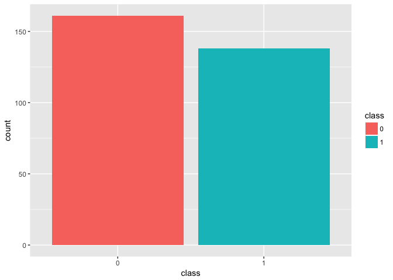
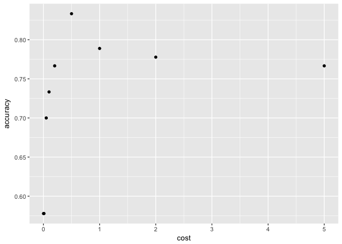

Introduction to Support Vector Machines - Heart Disease Detection
================
Anumeha Dwivedi
11 January 2018

### Loading Packages

``` r
library(ggplot2)
library(dplyr)
library(e1071)
library(caret)
```

### Understanding the data

``` r
heart <- read.csv("/Users/tinycloud/Documents/Spring 18/Data Mining 1/Data/heart_tidy_svm.csv")
colnames(heart) <- c("age", "sex", "cp", "trestbps", "chol", "fbs", "restecg", "thalach", "exaang", "oldpeak", "slope", "ca", "thal", "class")

colSums(is.na(heart))
```

    ##      age      sex       cp trestbps     chol      fbs  restecg  thalach 
    ##        0        0        0        0        0        0        0        0 
    ##   exaang  oldpeak    slope       ca     thal    class 
    ##        0        0        0        0        0        0

``` r
str(heart)
```

    ## 'data.frame':    299 obs. of  14 variables:
    ##  $ age     : int  67 67 37 41 56 62 57 63 53 57 ...
    ##  $ sex     : int  1 1 1 0 1 0 0 1 1 1 ...
    ##  $ cp      : int  4 4 3 2 2 4 4 4 4 4 ...
    ##  $ trestbps: int  160 120 130 130 120 140 120 130 140 140 ...
    ##  $ chol    : int  286 229 250 204 236 268 354 254 203 192 ...
    ##  $ fbs     : int  0 0 0 0 0 0 0 0 1 0 ...
    ##  $ restecg : int  2 2 0 2 0 2 0 2 2 0 ...
    ##  $ thalach : int  108 129 187 172 178 160 163 147 155 148 ...
    ##  $ exaang  : int  1 1 0 0 0 0 1 0 1 0 ...
    ##  $ oldpeak : num  1.5 2.6 3.5 1.4 0.8 3.6 0.6 1.4 3.1 0.4 ...
    ##  $ slope   : int  2 2 3 1 1 3 1 2 3 2 ...
    ##  $ ca      : int  3 2 0 0 0 2 0 1 0 0 ...
    ##  $ thal    : int  3 7 3 3 3 3 3 7 7 6 ...
    ##  $ class   : int  1 1 0 0 0 1 0 1 1 0 ...

``` r
head(heart)
```

    ##   age sex cp trestbps chol fbs restecg thalach exaang oldpeak slope ca
    ## 1  67   1  4      160  286   0       2     108      1     1.5     2  3
    ## 2  67   1  4      120  229   0       2     129      1     2.6     2  2
    ## 3  37   1  3      130  250   0       0     187      0     3.5     3  0
    ## 4  41   0  2      130  204   0       2     172      0     1.4     1  0
    ## 5  56   1  2      120  236   0       0     178      0     0.8     1  0
    ## 6  62   0  4      140  268   0       2     160      0     3.6     3  2
    ##   thal class
    ## 1    3     1
    ## 2    7     1
    ## 3    3     0
    ## 4    3     0
    ## 5    3     0
    ## 6    3     1

``` r
heart$class <- as.factor(heart$class)
```

### Bar plot

``` r
ggplot(data = heart, aes(x = class, fill = class)) +
  geom_bar()
```



### Test & train split

``` r
set.seed(123)
index = sample(1:nrow(heart), .7*nrow(heart))
train <- heart[index,]
test <- heart[-index,]
```

### Linear SVM Model

### 

#### Model fit for different values of cost

``` r
accuracy <- c()
j <- 1
cost <- c(0.001,.01, .05, .1, .2, .5, 1, 2,5)

for (i in cost)
{
  svm.linear <- svm(class ~ ., data = train, kernel = "linear", cost = i)
  test$pred <- predict(svm.linear, newdata = test)
  accuracy[j] = mean(test$pred == test$class)
  j <- j + 1
}

ggplot(data = data.frame(accuracy,cost), aes(x = cost, y = accuracy)) +
  geom_point()
```


From the plot, we see that our model has the best accuracy when cost = 0.05 or 0.01

#### Confusion Matrix for Linear SVM

``` r
svm.linear <- svm(class ~ ., data = train, kernel = "linear", cost = .01)
test$pred <- predict(svm.linear, newdata = test)
confusionMatrix(test$pred, test$class)
```

    ## Confusion Matrix and Statistics
    ## 
    ##           Reference
    ## Prediction  0  1
    ##          0 48  9
    ##          1  4 29
    ##                                           
    ##                Accuracy : 0.8556          
    ##                  95% CI : (0.7657, 0.9208)
    ##     No Information Rate : 0.5778          
    ##     P-Value [Acc > NIR] : 1.296e-08       
    ##                                           
    ##                   Kappa : 0.6986          
    ##  Mcnemar's Test P-Value : 0.2673          
    ##                                           
    ##             Sensitivity : 0.9231          
    ##             Specificity : 0.7632          
    ##          Pos Pred Value : 0.8421          
    ##          Neg Pred Value : 0.8788          
    ##              Prevalence : 0.5778          
    ##          Detection Rate : 0.5333          
    ##    Detection Prevalence : 0.6333          
    ##       Balanced Accuracy : 0.8431          
    ##                                           
    ##        'Positive' Class : 0               
    ## 

### Polynomial SVM

### 

#### Model fit for varying degrees, keeping cost at 0.05

``` r
accuracy <- c()
degree <- c(1,2,3,4,5,6)
c <- 0.05
j <- 1

for (i in degree)
{
  svm.poly <- svm(class ~., data = train, kernel = "polynomial", degree = i, cost = c)
  test$pred <- predict(svm.poly, newdata = test)
  accuracy[j] <- mean(test$pred == test$class)
  j <- j + 1
}

ggplot(data = data.frame(accuracy,degree), aes(x = degree, y = accuracy)) +
  geom_point()
```


For cost = 0.05, we get the higest accuracy when degree = 1 and followed by degree = 3. We know that degree = 1 implies a linear model so let us try a different model with varying cost with constant degree of 3.

#### Model fit for varying cost keeping degree = 3

``` r
accuracy <- c()
cost <- c(0.001,.01, .05, .1, .2, .5, 1, 2,5)
j <- 1

for (i in cost)
{
  svm.poly <- svm(class ~., data = train, kernel = "polynomial", degree = 3, cost = i)
  test$pred <- predict(svm.poly, newdata = test)
  accuracy[j] <- mean(test$pred == test$class)
  j <- j + 1
}

ggplot(data = data.frame(accuracy,cost), aes(x = cost, y = accuracy)) +
  geom_point()
```

 In polynomial SVM, we get our best fit for degree 3 when cost = 0.5

#### Confusion Matrix for Polynomial SVM

``` r
svm.poly <- svm(class ~., data = train, kernel = "polynomial", degree = 3, cost = 0.5)
test$pred <- predict(svm.poly, newdata = test)
confusionMatrix(test$pred, test$class)
```

    ## Confusion Matrix and Statistics
    ## 
    ##           Reference
    ## Prediction  0  1
    ##          0 49 12
    ##          1  3 26
    ##                                         
    ##                Accuracy : 0.8333        
    ##                  95% CI : (0.74, 0.9036)
    ##     No Information Rate : 0.5778        
    ##     P-Value [Acc > NIR] : 2.034e-07     
    ##                                         
    ##                   Kappa : 0.6472        
    ##  Mcnemar's Test P-Value : 0.03887       
    ##                                         
    ##             Sensitivity : 0.9423        
    ##             Specificity : 0.6842        
    ##          Pos Pred Value : 0.8033        
    ##          Neg Pred Value : 0.8966        
    ##              Prevalence : 0.5778        
    ##          Detection Rate : 0.5444        
    ##    Detection Prevalence : 0.6778        
    ##       Balanced Accuracy : 0.8133        
    ##                                         
    ##        'Positive' Class : 0             
    ## 

We see that our accuracy for polynomial SVM is almost equal to that of linear SVM.

### Radial SVM

### 

#### Model fit for varying gamma and cost

``` r
accuracy <- c(0)
cost <- c(0.001,.01, .05, .1, .2, .5, 1, 2,5)
gamma <- c(10^-6,10^-5,10^-4,10^-3,10^-2,10^-1,10^0,10^1,10^2,10^3)
j <- 1

for (i in cost)
{
  for (k in gamma)
  {
    svm.radial <- svm(class ~., data = train, kernel = "radial", gamma = k, cost = i)
    test$pred <- predict(svm.radial, newdata = test)
    accuracy[j] <- mean(test$pred == test$class)
    if(accuracy[j] >= max(accuracy))
    {
      des_gamma <- k
      des_cost <- i
    }
    j <- j + 1
  }
}

des_gamma
```

    ## [1] 0.001

``` r
des_cost
```

    ## [1] 2

We get our highest accuracy at gamma = 0.001 and cost = 0.2. It is observed that higher penalty is desirable in radial model as compared to linear model.

#### Confusion Matrix for Radial SVM

``` r
svm.radial <- svm(class ~., data = train, kernel = "radial", gamma = .001, cost = 2)
test$pred <- predict(svm.radial, newdata = test)
confusionMatrix(test$pred, test$class)
```

    ## Confusion Matrix and Statistics
    ## 
    ##           Reference
    ## Prediction  0  1
    ##          0 48  8
    ##          1  4 30
    ##                                           
    ##                Accuracy : 0.8667          
    ##                  95% CI : (0.7787, 0.9292)
    ##     No Information Rate : 0.5778          
    ##     P-Value [Acc > NIR] : 2.884e-09       
    ##                                           
    ##                   Kappa : 0.7228          
    ##  Mcnemar's Test P-Value : 0.3865          
    ##                                           
    ##             Sensitivity : 0.9231          
    ##             Specificity : 0.7895          
    ##          Pos Pred Value : 0.8571          
    ##          Neg Pred Value : 0.8824          
    ##              Prevalence : 0.5778          
    ##          Detection Rate : 0.5333          
    ##    Detection Prevalence : 0.6222          
    ##       Balanced Accuracy : 0.8563          
    ##                                           
    ##        'Positive' Class : 0               
    ## 

### Sigmoid SVM

### 

#### Model Fit for varying Gamma and cost

``` r
accuracy <- c(0)
cost <- c(0.001,.01, .05, .1, .2, .5, 1, 2,5)
gamma <- c(10^-6,10^-5,10^-4,10^-3,10^-2,10^-1,10^0,10^1,10^2,10^3)
j <- 1

for (i in cost)
{
  for (k in gamma)
  {
    svm.sigmoid <- svm(class ~., data = train, kernel = "sigmoid", gamma = k, cost = i)
    test$pred <- predict(svm.sigmoid, newdata = test)
    accuracy[j] <- mean(test$pred == test$class)
    if(accuracy[j] >= max(accuracy))
    {
      des_gamma <- k
      des_cost <- i
    }
    j <- j + 1
  }
}

des_gamma
```

    ## [1] 0.001

``` r
des_cost
```

    ## [1] 5

We get our highest accuracy at gamma = 0.001 and cost = 5. It is observed that higher penalty is desirable in sigmoid model as compared to linear or even a radial model for that matter.

#### Confusion Matrix for Sigmoid SVM

``` r
svm.sigmoid <- svm(class ~., data = train, kernel = "sigmoid", gamma = .001, cost = 5)
test$pred <- predict(svm.sigmoid, newdata = test)
confusionMatrix(test$pred, test$class)
```

    ## Confusion Matrix and Statistics
    ## 
    ##           Reference
    ## Prediction  0  1
    ##          0 47  8
    ##          1  5 30
    ##                                           
    ##                Accuracy : 0.8556          
    ##                  95% CI : (0.7657, 0.9208)
    ##     No Information Rate : 0.5778          
    ##     P-Value [Acc > NIR] : 1.296e-08       
    ##                                           
    ##                   Kappa : 0.7008          
    ##  Mcnemar's Test P-Value : 0.5791          
    ##                                           
    ##             Sensitivity : 0.9038          
    ##             Specificity : 0.7895          
    ##          Pos Pred Value : 0.8545          
    ##          Neg Pred Value : 0.8571          
    ##              Prevalence : 0.5778          
    ##          Detection Rate : 0.5222          
    ##    Detection Prevalence : 0.6111          
    ##       Balanced Accuracy : 0.8467          
    ##                                           
    ##        'Positive' Class : 0               
    ## 

### Model comparison

Overall, we get our highest accuracy with a radial model (accuracy = 86.67% with cost = 2 and gamma = 0.001)
